# Week 04 Basic CSharp Language

## การใช้งานภาษา C# ขั้นพื้นฐาน

## วัตถุประสงค์  

1. เพื่อให้นักศึกษาบอกชื่อ method ที่ใช้ในการแสดงผลบน Text Mode ขั้นพื้นฐานในภาษา C# ได้
2. เพื่อให้นักศึกษาสามารถใช้คำสั่งแสดงผลทางหน้าจอ เบื้องต้นได้

## 1. การเตรียมการก่อนการทดลอง

👉 สร้าง repository ใน account ของตนเองบน Github (ทำได้โดยการใช้ interface ผ่าน visual studio 2017)

ส่วนสำคัญของโปรแกรม lab01.cs คือบรรทัดที่ 1 “using System” และเมธอด Main(string[] args)

👉 ให้ลบ source code ในบรรทัดที่ 2-5 ออกไปก่อน เนื่องจากเป็น assembly ที่ไม่จำเป็นต่อการทำงานของโปรแกรม

### คำสั่ง

* ในการทดลองหรือเขียนโปรแกรมในแต่ละข้อ ให้ทำการ commit ลงใน repository ทุกครั้ง
* ในการทดลองแต่ละหัวข้อ ให้แยก branch ทุกครั้ง เช่น หัวข้อที่ 1 ใช้ชื่อ branch W04P01
สัญลักษณ์ที่ใช้หน้าบรรทัดที่สำคัญ  

👉 หมายถึงคำสั่ง  
➢ หมายถึงการรันโปรแกรมและบันทึกผล  
❔ หมายถึงคำถาม ให้ตอบลงใน google doc  
👷 หมายถึงการเขียนโปรแกรมด้วยตนเอง  

## การใช้งานคำสั่ง Console.Write() และ Console.WriteLine()

## 2. เมดธอด Console.Write()

👉 ให้เพิ่ม บรรทัดต่อไปนี้ลงไปในในเมธอด Main()

 ```csharp
 Console.Write("Hello");
```

ให้แก้โค้ดเป็นดังต่อไปนี้

```csharp
using System;
namespace Lab01
{
    class Program
    {
        static void Main(string[] args)
        {
            Console.Write("Hello");
        }
    }
}
```

<!--
<details>
<summary>
<a class="btnfire small stroke"><em class="fas fa-chevron-circle-down"></em>&nbsp;&nbsp;อธิบายโค้ด</a>
</summary>
</details>
-->

➢ รันโปรแกรมและบันทึกผล

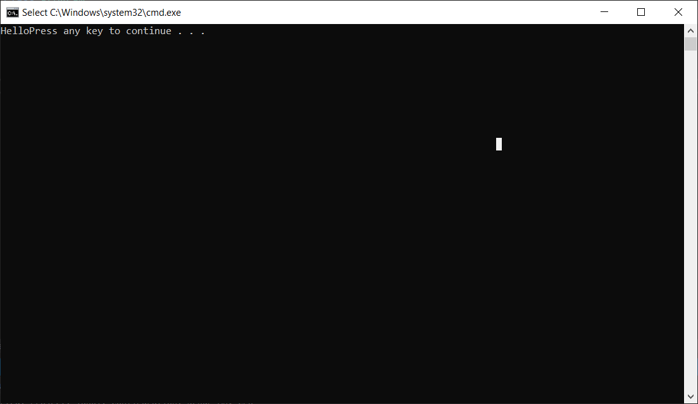

👉 แก้ไขโปรแกรม ให้เป็นดังด้านล่างนี้

```csharp
using System;
namespace Lab01
{
    class Program
    {
        static void Main(string[] args)
        {
            Console.Write("Hello");
            Console.Write("Hello");
        }
    }
}
```

➢ รันโปรแกรมและบันทึกผล

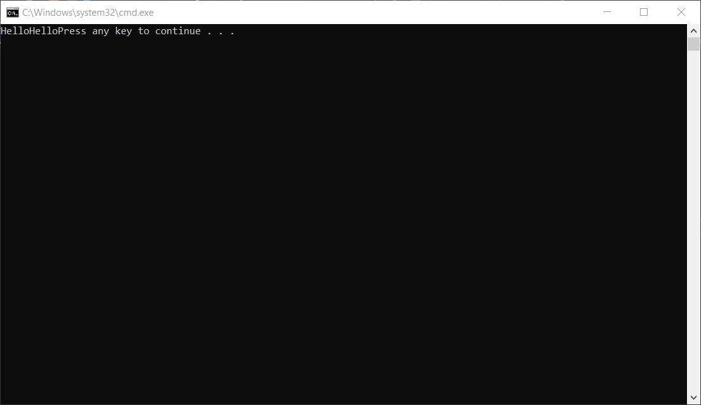

⚠ __หมายเหตุ__ การรันแล้วทำให้หน้าจอ console ยังคงแสดงผลค้างอยู่นั้น ให้เลือกเมนู Debug -> Start Without Debugging (Ctrl+F5) มิฉะนั้น หน้าจอ console จะหายไปอย่างรวดเร็ว

❔ ผลที่ได้จากการทดลอง เป็นอย่างที่นักศึกษาคิดหรือไม่ อย่างไร จงอธิบาย

``` text

เป็นไปตามที่คิดเนื่องจากการที่เราใช้คำสั่ง Write อย่างเดียวนั้นเมื่อเราสั่งคำสั่งต่อไปจะทำงงานในบรรทัดเดยวกัน


```

## 3. เมดธอด Console.WriteLine()

👉 แก้โปรแกรมในเมดธอด Main() ให้เป็นดังต่อไปนี้

```csharp
using System;
namespace Lab01
{
    class Program
    {
        static void Main(string[] args)
        {
            Console.WriteLine("Hello");
        }
    }
}
```

➢ รันโปรแกรมและบันทึกผล


👉 แก้ไขโปรแกรม ให้เป็นดังรูปด้านล่างนี้

```csharp
using System;
namespace Lab01
{
    class Program
    {
        static void Main(string[] args)
        {
            Console.WriteLine("Hello");
            Console.WriteLine(" World.");
        }
    }
}
```

➢ รันโปรแกรมและบันทึกผล

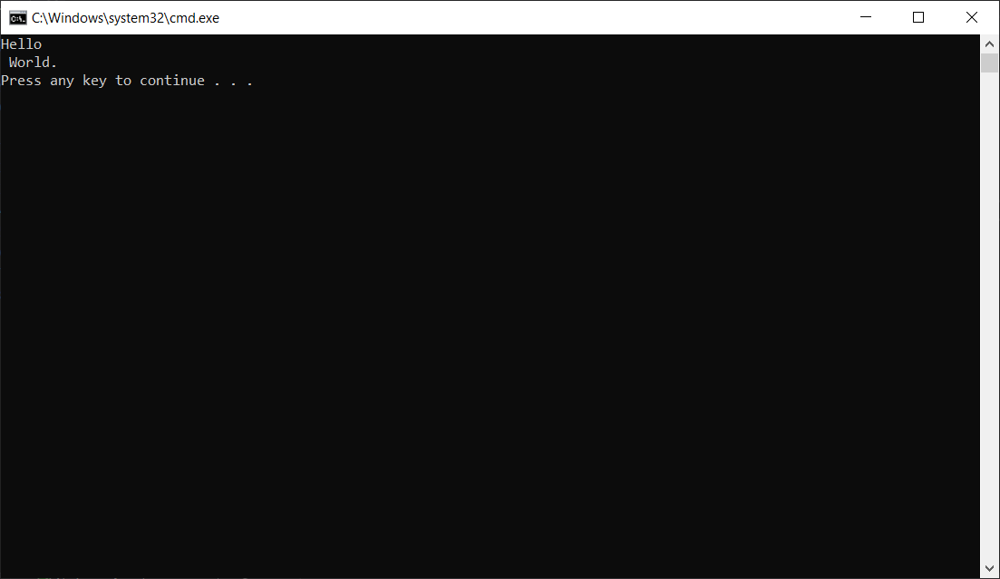

❔ ผลที่ได้จากการทดลอง เป็นอย่างที่นักศึกษาคิดหรือไม่ อย่างไร จงอธิบาย

```text
เป็นไปตามที่คิดเนื่องจากการที่เราใช้คำสั่ง WriteLine อย่างเดียวนั้นเมื่อเราสั่งคำสั่งต่อไปจะทำงงานคนละบรรทัด


```

❔ จงอธิบายความแตกต่างระหว่างคำสั่ง Console.Write() และ Console.WriteLine()

```text
Console.Write()
สั่ง print เสร็จ การทำงานครั้งต่อไปให้ทำบรรทัดเดียวกัน
Console.WriteLine()
ให้ขึ้นบรรทัดใหม่หลังทำงานนั้นเสร็จ
```

## 4. จำนวนของอาร์กิวเมนต์ในคำสั่ง Console.WriteLine()

👉 แก้โปรแกรมตามรูปด้านล่างนี้

```csharp
using System;
namespace Lab01
{
    class Program
    {
        static void Main(string[] args)
        {
            Console.WriteLine("This is text 1.");
            Console.WriteLine("This is text 2.");
            Console.WriteLine("This is text 3.");
        }
    }
}
```

➢ รันโปรแกรมและบันทึกผล


👉 แก้โปรแกรมตามรูปด้านล่างนี้

```csharp
using System;
namespace Lab01
{
    class Program
    {
        static void Main(string[] args)
        {
            Console.WriteLine(" {0} and {1}", 3, 6);
        }
    }
}
```

➢ รันโปรแกรมและบันทึกผล


❔ เครื่องหมาย { } ในคำสั่ง Console.WriteLine() มีลักษณะการใช้งานอย่างไร

```text

{ } ด้านในให้ใส่ลำดับที่ต้องการลงไป จากนั้นด้านนอกของ " " ให้ใส่ค่าที่ต้องการสดงลงไป


```

❔ ถ้ามีการใช้ตัวเลขใน { } ที่กระโดด เช่น {0} {2} {3} จะใช้งานได้หรือไม่ อย่างไร จงอธิบาย

```text

ได้ นื่องจากตัวเลขที่อยู่ด้านในเป็นการให้เอาลำดับของตัวแปรที่อยู่ นอก " " มาโชว์ค่า


```

👉แก้โปรแกรมตามรูปด้านล่างนี้

```csharp
using System;
namespace Lab01
{
    class Program
    {
        static void Main(string[] args)
        {
            Console.WriteLine("{1}, {0} and {1}", 3, 6);
        }
    }
}
```

➢ รันโปรแกรมและบันทึกผล


## 5. การกำหนดความกว้างของอาร์กิวเมนต์

👉แก้โปรแกรมตามรูปด้านล่างนี้

```csharp
using System;
namespace Lab01
{
    class Program
    {
        static void Main(string[] args)
        {
            Console.WriteLine("00000000011111111112");
            Console.WriteLine("12345678901234567890");
            Console.WriteLine("{0, 0}", 1);
            Console.WriteLine("{0, 1}", 1);
            Console.WriteLine("{0, 2}", 1);
            Console.WriteLine("{0, 3}", 1);
            Console.WriteLine("{0, 5}", 1);
            Console.WriteLine("{0, 10}", 1);
            Console.WriteLine("{0, 15}", 1);
            Console.WriteLine("{0, 20}", 1);
        }
    }
}
```

➢ รันโปรแกรมและบันทึกผล

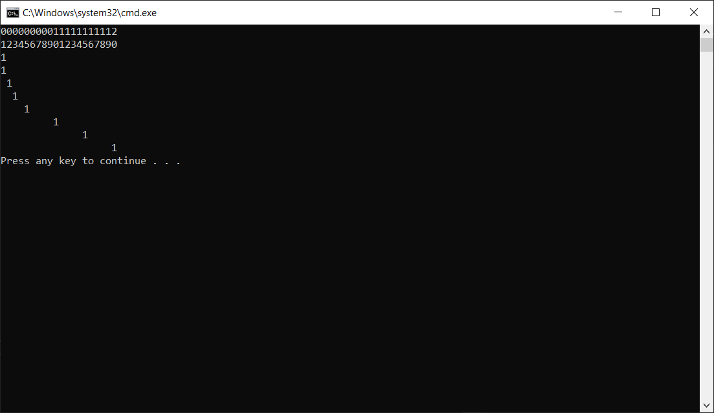

❔ การกำหนดความกว้างของอาร์กิวเมนต์ด้วยเครื่องหมาย { , } ในคำสั่ง ``Console.WriteLine()`` มีรูปแบบการใช้งานอย่างไร

```text

 { , } ที่ด้านหน้า , ให้ใส่เป็นลำดับขั้นที่แสดงและ ด้านหลังนั้นให้ใส่เป็นตำแหน่งงที่ต้องการแสดงของบรรทัดนั้นๆ


```

## 6. การกำหนดรูปแบบของอาร์กิวเมนต์

👉 แก้โปรแกรมตามรูปด้านล่างนี้

```csharp
using System;
namespace Lab01
{
    class Program
    {
        static void Main(string[] args)
        {
            int n = 123456789;
            Console.WriteLine("{0, 0:E}", n);
            Console.WriteLine("{0, 0:F}", n);
            Console.WriteLine("{0, 0:G}", n);
            Console.WriteLine("{0, 0:N}", n);
            Console.WriteLine("{0, 0:P}", n);
            Console.WriteLine("{0, 0:X}", n);
        }
    }
}
```

➢ รันโปรแกรมและบันทึกผล

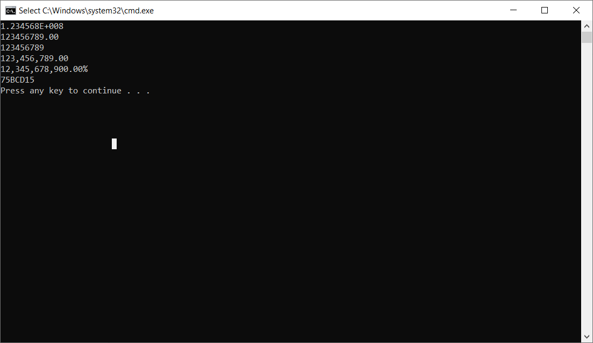

## 7. การกำหนดรูปแบบพร้อมความกว้างของอาร์กิวเมนต์

👉 แก้โปรแกรมตามรูปด้านล่างนี้

```csharp
using System;
namespace Lab01
{
    class Program
    {
        static void Main(string[] args)
        {
            int n = 123456789;
            Console.WriteLine("{0, 20:E}", 1);
            Console.WriteLine("{0, 20:F}", 1);
            Console.WriteLine("{0, 20:G}", 1);
            Console.WriteLine("{0, 20:N}", 1);
            Console.WriteLine("{0, 20:P}", 1);
            Console.WriteLine("{0, 20:X}", 1);
        }
    }
}
```

➢   รันโปรแกรมและบันทึกผล

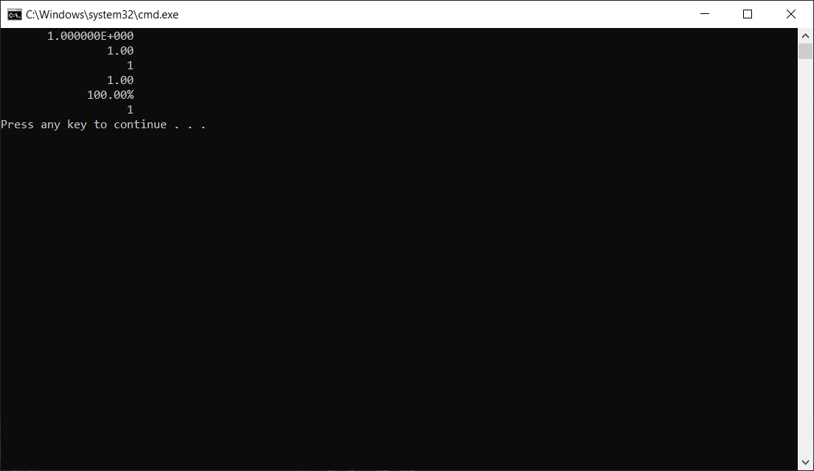

## 8. การกำหนดรูปแบบพร้อมความกว้างของทศนิยมของอาร์กิวเมนต์

👉 แก้โปรแกรมตามรูปด้านล่างนี้

```csharp
using System;
namespace Lab01
{
    class Program
    {
        static void Main(string[] args)
        {
            const double i = 123.456789d;
            Console.WriteLine("{0:F1}", i);
            Console.WriteLine("{0:F2}", i);
            Console.WriteLine("{0:F3}", i);
            Console.WriteLine("{0:F4}", i);
            Console.WriteLine("{0:F5}", i);
        }
    }
}
```

➢ รันโปรแกรมและบันทึกผล

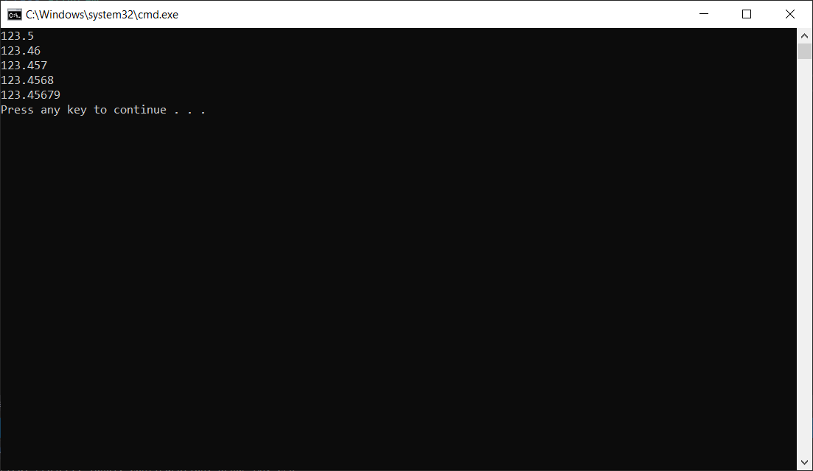

## ❔ แบบฝึกหัด จงระบุ output ของบรรทัดคำสั่งต่อไปนี้

``` csharp
1. string name = "Hello";
    Console.WriteLine(String.Format("{0} there. I said {0}! {0}???", name));
```

```Text

Hello there. I said Hello! Hello???

```

``` csharp
2. Console.WriteLine("{2:d} {0:d} {1:d}", 1, 2, 3);
```

```Text

3 2 1

```

``` csharp
3. Console.WriteLine("Hello " + "World");
```

```Text

Hello World

```

``` csharp
4. Console.WriteLine("Here comes a slash \\");
```

```Text

Here comes a slash \

```

``` csharp
5. Console.WriteLine("|{0, 10}|", 999);
```

```Text

|        999|

```

``` csharp
6. Console.WriteLine("|{0,-10}|", 000);
```

```Text

|000       |

```

``` csharp
7. Console.WriteLine("The value: {0}.", 500);
```

```Text

The value: 500

```

``` csharp
8. Console.WriteLine("The value: {0:C}.", 500);
```

```Text

The value  : $500

```

``` csharp
9. Console.WriteLine("{0,-10:F4}", 12.3456789);
```

```Text

12.3457

```

``` csharp
10. Console.WriteLine("{0,-10:C}", 12.3456789);
```

```Text

$12.35

```

``` csharp
11. Console.WriteLine("{0,-10:E3}", 12.3456789);
```

```Text

1.235E+001

```

``` csharp
12. Console.WriteLine("{0,-10:x}", 65535);  // (x = lower case)
```

```Text

ffff

```

``` csharp
13. Console.WriteLine("{0,-10:X}", 65535);  // (X = upper case)
```

```Text

FFFF

```

``` csharp
14. int i;
    Console.WriteLine("Value\tSquared\tCubed");
    for(i = 1; i < 10; i++)
        Console.WriteLine("{0}\t{1}\t{2}", i, i*i, i*i*i);
```

```Text

Value   squard  cubed
1       1       1
2       4       8
3       9       27  
4       16      24
5       25      125
6       36      216
7       49      343
8       64      512
9       81      729

```

``` csharp
15. Console.WriteLine("{0:#.###}.", 1234.56789);
```

```Text

1234.568.

```

## การใช้งานคำสั่ง Console.Read() และ Console.ReadLine()

### ความรู้เบื้องต้น

คำสั่งที่ใช้รับค่าตัวอักษรทางอินพุตมาตรฐานของ C# คือ Console.Read() และ Console.ReadLine() โดยทั้งสองจะมีข้อแตกต่างกันคือ Read() จะอ่านตัวอักษร ส่วน ReadLine() จะอ่านสตริงจนกว่าจะกด Enter ในการรับค่าด้วย Read() และ ReadLine() จะรับเฉพาะค่า ASCII เท่านั้น หากต้องการรับค่าตัวเลข จะต้องมีการแปลง ASCII ของตัวเลขที่พิมพ์เข้ามาให้เป็นค่าตัวเลข เช่นในการรับอักษร “22” จะไม่ได้หมายถึงค่าตัวเลข 22

## 9. การรับตัวอักษรจากคีย์บอร์ด

👉 แก้ไขโปรแกรมให้เป็นดังรูป

```csharp
using System;
namespace Lab01
{
    class Program
    {
        static void Main(string[] args)
        {
            char ch;
            Console.Write("Press a key followed by ENTER:");
            ch = (char)Console.Read();  // get a char
            Console.WriteLine("Your key is: "+ch);
        }
    }
}
```

➢ รันโปรแกรมและบันทึกผล


❔ ถ้าพิมพ์ตัวอักษรจำนวนหลายๆ ตัวแล้วกด Enter จะได้ผลอย่างไร ทำไมจึงเป็นเช่นนั้น

```text

จะโชว์ค่าแค่ตัวอักษรแรกที่พิมพ์

```

❔ ในบรรทัดซึ่งมีโปรแกรมเป็น ch = (char)Console.Read(); นั้น ถ้าตัด (char) ออกไป จะเกิดอะไรขึ้น ให้อธิบายประกอบ

```text

Error

```

## 10. การรับ string จากคีย์บอร์ด

👉 แก้ไขโปรแกรมให้เป็นดังรูป

```csharp
using System;
namespace Lab01
{
    class Program
    {
        static void Main(string[] args)
        {
            string str;
            Console.Write("Enter some characters.");
            str = Console.ReadLine();
            Console.WriteLine("You entered: "+str);
        }
    }
}
```

➢ รันโปรแกรมและบันทึกผล

]  

## 11. การรับค่าตัวเลขจากคีย์บอร์ด

เนื่องจากคำสั่ง Read() และ ReadLine() จะรับเฉพาะตัวอักษร การรับตัวเลข เราต้องใช้เมธอด TryParse() มาช่วยแปลงค่า

👉 แก้ไขโปรแกรมให้เป็นดังรูป

```csharp
using System;
namespace Lab01
{
    class Program
    {
        static void Main(string[] args)
        {
            string str;
            Console.Write("Please enter value 1 : ");
            int val1 = Convert.ToInt32(Console.ReadLine());
            Console.WriteLine(val1);
        }
    }
}
```

➢ รันโปรแกรม โดยป้อนตัวเลขใดๆ และบันทึกผลที่ได้


❔ ถ้าเราป้อนตัวอักษรลงไปแทนที่ตัวเลข จะเกิดอะไรขึ้น มีวิธีการป้องกันหรือแก้ไขอย่างไร

```text

Eror System.FormatException

```

## 12. การรับค่าตัวเลขจากคีย์บอร์ด (ป้องกันโดยใช้ประโยค try{…} catch{…})

ในบางกรณีที่ผู้ใช้ป้อนตัวอักษร จะทำให้เกิด error และทำให้โปรแกรม hang ได้ จึงต้องมีการป้องกันโดยใช้ประโยค `try{…}` `catch{…}` (ประโยค `try{…}` `catch{…}`   นี้จะศึกษารายละเอียดภายหลัง)

👉 แก้ไขโปรแกรมให้เป็นดังรูป

```csharp
using System;
namespace Lab01
{
    class Program
    {
        static void Main(string[] args)
        {
            try
            {
                Console.Write("Please enter value 1 :");
                int val1 = Convert.ToInt32(Console.ReadLine());
                Console.Write("Please enter value 2 :");
                int val2 = Convert.ToInt32(Console.ReadLine());
                Console.WriteLine("Answer = " + (val1 + val2));
            }
            catch (Exception e)
            {
                Console.WriteLine("Error : " + e.ToString());
            }
        }
    }
}
```

➢ รันโปรแกรม โดยป้อนตัวเลขใดๆ และบันทึกผล


❔ ถ้าเราป้อนตัวอักษรลงไปแทนที่ตัวเลข จะเกิดอะไรขึ้น เหมือนหรือต่างจากโปรแกรมก่อนหน้านี้อย่างไร

```text

error System.FormatExection


```

## 📝 แบบฝึกหัด

ให้เขียน code ในการรับค่าอินพุตต่อไปนี้และแสดงออกหน้าจอให้ถูกต้อง Name : (ป้อนชื่อของนักศึกษา)

``Lastname :`` (ป้อนนามสกุลนักศึกษา)  
``ID :`` (ป้อนรหัสนักศึกษา)  
``GPA :`` (ป้อนเกรดเฉลี่ยนักศึกษา โดยมีทศนิยมสองหลัก)  

```csharp

using System;
namespace Lab01
{
    class Program
    {
        static void Main(string[] args)
        {
            try
            {
                Console.Write("Please enter Name : ");
                string fname = Console.ReadLine();
                Console.Write("Please enter LastName : ");
                string lname = Console.ReadLine();
                Console.Write("Please enter ID : ");
                int id = int.Parse(Console.ReadLine());
                Console.Write("Please enter GPA : ");
                int gpa = int.Parse(Console.ReadLine());

                Console.WriteLine($"Name : {fname} Lastname : {lanme}");
                Console.WriteLine($"ID   : {id}");
                Console.WriteLine($"GPA  : {gpa}");
            }
            catch (Exception e)
            {
                Console.WriteLine("Error : " + e.ToString());
            }
        }
    }
}

```

## การตั้งชื่อตัวแปรในภาษา C\#

 ให้นักศึกษาพิจารณาชื่อตัวแปรตามตารางต่อไปนี้ ว่าสามารถใช้ได้หรือไม่ พร้อมบอกเหตุผล

| ชื่อตัวแปร | ใช้ได้/ไม่ได้ | เหตุผล|
|--|--|--|
| `xxx`     | ใช้ได้ | ไม่มีตัวอักษรที่ละเมิดกฎการตั้งชื่อ |
| `null` |ใช้ไม่ได้ |อยู่ในคำสงวน |
| `_value` |ใช้ได้ |ไม่มีตัวอักษรที่ละเมิดกฎการตั้งชื่อ |
| `First-name`|ใช้ได้ |ไม่มีตัวอักษรที่ละเมิดกฎการตั้งชื่อ |
| `Hello!` |ใช้ได้ |ไม่มีตัวอักษรที่ละเมิดกฎการตั้งชื่อ |
| `w*h` |ใช้ไม่ได้ |มีอักขระพิเศษ |
| `time` |ใช้ได้ |ไม่มีตัวอักษรที่ละเมิดกฎการตั้งชื่อ |
| `do` |ใช้ไม่ได้ |อยู่ในคำสงวน |
| `Do` |ใช้ได้ |ไม่มีตัวอักษรที่ละเมิดกฎการตั้งชื่อ |
| `21November`|ใช้ไม่ได้ |ตัวเลขขึ้นต้น |
| `ladkrabang`|ใช้ได้ |ไม่มีตัวอักษรที่ละเมิดกฎการตั้งชื่อ |
| `Student ID`|ใช้ได้ |ไม่มีตัวอักษรที่ละเมิดกฎการตั้งชื่อ |

## ชนิดข้อมูลภายในภาษา C\#

Property ของชนิดข้อมูล ในภาษา C# มีชนิดข้อมูลต่างๆ ได้แก่ `byte`, `char`, `bool`, `sbyte`, `short`, `ushort`, `int` , `uint`, `float`, `double`, `decimal`, `long`, `ulong` โดยแต่ละชนิด มีคุณสมบัติที่สำคัญได้แก่ ขนาด (เป็นไบต์) ค่าต่ำสุด ค่าสูงสุด ที่เก็บในตัวแปรชนิดนั้นๆ ได้ ซึ่งมีฟังก์ชันในภาษา C# ที่ช่วยให้เราทราบคุณสมบัติเหล่านั้น ได้แก่คำสั่ง `sizeof()`, `MinValue()` และ `MaxValue()` การแสดงค่าคุณสมบัติต่างๆ ของตัวแปร สามารถทำได้โดยใช้ฟังก์ชั่นเหล่านั้น ดังตัวอย่าง

## 13. โปรแกรมแสดงคุณสมบัติ size, MinValue และ MaxValue ของชนิดข้อมูล

```csharp
using System;
namespace variableProperties
{
    class Program
    {
        static void Main(string[] args)
        {
            Console.WriteLine("Data type : int");
            Console.WriteLine("Size :" + sizeof(int));
            Console.WriteLine("Minimum Value :" + int.MinValue);
            Console.WriteLine("Maximum Value :" + int.MaxValue);
        }
    }
}
```

### ผลที่ได้จากโปรแกรม

```text
Data type : int
Size :4
Minimum Value :-2147483648
Maximum Value :2147483647
```

👉 คำสั่งสำหรับการทดลอง  

ให้นักศึกษา เขียนโปรแกรมคล้ายกับตัวอย่างที่ 1 โดยมีชนิดข้อมูลเป็น `byte`, `char`, `bool`, `sbyte`, `short`, `ushort`, `uint`, `float`, `double`, `decimal`, `long` `และ ulong`  

```csharp
using System;
namespace variableProperties
{
    class Program
    {
        static void Main(string[] args)
        {
            Console.WriteLine("Data type : byte");
            Console.WriteLine("Size :" + sizeof(byte));
            Console.WriteLine("Minimum Value :" + byte.MinValue);
            Console.WriteLine("Maximum Value :" + byte.MaxValue);

            Console.WriteLine("Data type : char");
            Console.WriteLine("Size :" + sizeof(char));
            Console.WriteLine("Minimum Value :" + (int) char.MinValue);
            Console.WriteLine("Maximum Value :" + (int) char.MaxValue);

            Console.WriteLine("Data type : bool");
            Console.WriteLine("Size :" + sizeof(bool));
            Console.WriteLine("Minimum Value :" + false);
            Console.WriteLine("Maximum Value :" + true);

            Console.WriteLine("Data type : sbyte");
            Console.WriteLine("Size :" + sizeof(sbyte));
            Console.WriteLine("Minimum Value :" + sbyte.MinValue);
            Console.WriteLine("Maximum Value :" + sbyte.MaxValue);

            Console.WriteLine("Data type : short");
            Console.WriteLine("Size :" + sizeof(short));
            Console.WriteLine("Minimum Value :" + short.MinValue);
            Console.WriteLine("Maximum Value :" + short.MaxValue);

            Console.WriteLine("Data type : ushort");
            Console.WriteLine("Size :" + sizeof(ushort));
            Console.WriteLine("Minimum Value :" + ushort.MinValue);
            Console.WriteLine("Maximum Value :" + ushort.MaxValue);

            Console.WriteLine("Data type : uint");
            Console.WriteLine("Size :" + sizeof(uint));
            Console.WriteLine("Minimum Value :" + uint.MinValue);
            Console.WriteLine("Maximum Value :" + uint.MaxValue);

            Console.WriteLine("Data type : float");
            Console.WriteLine("Size :" + sizeof(float));
            Console.WriteLine("Minimum Value :" + float.MinValue);
            Console.WriteLine("Maximum Value :" + float.MaxValue);

            Console.WriteLine("Data type : double");
            Console.WriteLine("Size :" + sizeof(double));
            Console.WriteLine("Minimum Value :" + double.MinValue);
            Console.WriteLine("Maximum Value :" + double.MaxValue);

            Console.WriteLine("Data type : decimal");
            Console.WriteLine("Size :" + sizeof(decimal));
            Console.WriteLine("Minimum Value :" + decimal.MinValue);
            Console.WriteLine("Maximum Value :" + decimal.MaxValue);

            Console.WriteLine("Data type : long");
            Console.WriteLine("Size :" + sizeof(long));
            Console.WriteLine("Minimum Value :" + long.MinValue);
            Console.WriteLine("Maximum Value :" + long.MaxValue);

            Console.WriteLine("Data type : ulong");
            Console.WriteLine("Size :" + sizeof(ulong));
            Console.WriteLine("Minimum Value :" + ulong.MinValue);
            Console.WriteLine("Maximum Value :" + ulong.MaxValue);

        }
    }
}
```

### หมายเหตุ

ชนิดข้อมูล bool เก็บข้อมูลได้เฉพาะ true และ false ไม่ต้องหา MinValue และ MaxValue
ชนิดข้อมูล char จะต้องมีการ cast ค่า MinValue และ MaxValue ไปยัง int ก่อน ดังนี้

```csharp
Console.WriteLine("Minimum Value :" + (int) char.MinValue);
Console.WriteLine("Maximum Value :" + (int) char.MaxValue);
```

## การใช้งานข้อมูลชนิดต่างๆ

ข้อมูลชนิดตรรกะ The Boolean Type
ข้อมูลชนิดตรรกะ (boolean) มีค่าที่เป็นไปได้เพียง 2 ค่าเท่านั้นคือ true และ false ในภาษา C# จะไม่สามารถกำหนดค่าตัวเลขลงไปในตัวแปร boolean ได้ ส่วนใหญ่ตัวแปร boolean มักใช้เพื่อการตัดสินใจและมีที่มาจากการประเมินค่าสมการต่างๆ ตัวอย่างต่อไปนี้เป็นการใช้ตัวแปร boolean กับการเปรียบเทียบด้วยตัวดำเนินการ “>”
ตัวอย่าง

```csharp
using System;
class Operators {
    static void Main() {
        bool a = 4 > 5;
        Console.WriteLine("{0}", a);
    }
}
```

## สนุกกับการสร้างตัวเลขสุ่ม

ในภาษา C# มีวิธีการสร้างตัวเลขสุ่ม (random number) โดยใช้คลาส Random มาสร้างเป็นตัวแปรโดยมีรูปแบบดังนี้

```csharp
Random random = new Random();
```

เมื่อสร้างแล้ว เราสามารถนำมาหาค่าตัวเลขสุ่มจากตัวแปรดังกล่าว ซึ่งมักจะกำหนดค่าสูงสุดและต่ำสุดในการสุ่มลงไปด้วย ดังนี้

```csharp
int randomNumber = random.Next(0, 100);
```

โปรแกรมด้านล่างนี้เป็นตัวอย่างการสุ่มเลข 0 – 100

```csharp
using System;
namespace RandomNumber
{
    class Program
    {
        static void Main(string[] args)
        {
            Random random = new Random();
            int randomNumber = random.Next(0, 100);
            Console.WriteLine(randomNumber);
        }
    }
}
```

## 14. การใช้งานข้อมูลชนิด boolean (1)

👉 ให้เขียนโปรแกรมโดยมีข้อกำหนดดังนี้

1. สร้างตัวแปร Random โดยการมีสุ่มเลข 1 หลัก (0–9)

```csharp
using System;
namespace RandomNumber
{
    class Program
    {
        static void Main(string[] args)
        {
            Random rd = new Random();
            int r = rd.Next(0, 10);
            Console.WriteLine($"number random  : {r}");

        }
    }
}
```

2. สร้างตัวแปรชนิด integer สำหรับรับค่าจากผู้ใช้

```csharp
using System;
namespace RandomNumber
{
    class Program
    {
        static void Main(string[] args)
        {
            Console.Write("Enter number : ");
            int n = int.Parse(Console.ReadLine());
            Console.WriteLine("Your number : " + n);
        }
    }
}
```

3. สร้างตัวแปร boolean โดยเก็บค่าที่ได้จากการเปรียบเทียบตัวเลขในข้อ 1 และ 2

```csharp
using System;
namespace RandomNumber
{
    class Program
    {
        static void Main(string[] args)
        {
            Console.Write("Enter number : ");
            int n = int.Parse(Console.ReadLine());

            Random rd = new Random();
            int r = rd.Next(0, 10);
            Console.WriteLine($"number random  : {r}");

            bool a;

            if (n == r)
            {
                a = true;
            }
            else
            {
                a = false;
            }

        }
    }
}
```

4. ให้พิมพ์ค่าตัวแปร boolean ในข้อ 3 ออกทางหน้าจอ

```csharp
using System;
namespace RandomNumber
{
    class Program
    {
        static void Main(string[] args)
        {
            Console.Write("Enter number : ");
            int n = int.Parse(Console.ReadLine());

            Random rd = new Random();
            int r = rd.Next(0, 10);
            Console.WriteLine($"number random  : {r}");

            bool a;

            if (n == r)
            {
                a = true;
            }
            else
            {
                a = false;
            }

            Console.WriteLine("number = random ?   :   {0}", a);
        }
    }
}

```

## 15. การเขียนโปรแกรมด้วยตัวดำเนินการทางตรรกะ

ตัวแปรชนิด boolean มักจะถูกใช้เป็นที่เก็บผลที่เกิดจากการดำเนินการทางตรรกะ เช่น AND, OR, NOT เป็นต้น ซึ่งการดำเนินการทางตรรกะจะมีตารางความจริง เป็นตัวบอกผลในการดำเนินการของตัวดำเนินการต่างๆ ดังตัวย่าง

### ตัวดำเนินการ AND

Y = A AND B

| A | B | Y |
|---|---|---|
| 0 | 0 | 0 |
| 0 | 1 | 0 |
| 1 | 0 | 0 |
| 1 | 1 | 1 |

### ตัวดำเนินการ OR

Y = A OR B

| A | B | Y |
|---|---|---|
| 0 | 0 | 0 |
| 0 | 1 | 0 |
| 1 | 0 | 0 |
| 1 | 1 | 1 |

### ตัวดำเนินการ NOT

Y = NOT A

| A | Y |
|--|--|
| 0 | 1 |
| 1 | 0 |

ตัวดำเนินการในภาษา C#
ใช้เครื่องหมายต่างๆ ดังต่อไปนี้

| การดำเนินการ | เครื่องหมาย |
|------------|-----------|
| Logical AND | & |
| Logical XOR | ^ |
| Logical OR | \| |

## 16. การเขียนโปรแกรมด้วยตัวดำเนินการทางตรรกะ

ตัวอย่างภาษา C# ต่อไปนี้เป็นการพิมพ์ตารางความจริงออกทางหน้าจอ
👉 ให้เขียนโปรแกรมต่อไปนี้

```csharp
using System;
namespace thruthTable
{
    class Program
    {
        static void Main(string[] args)
        {
            bool A, B,Y;
            Console.WriteLine("      Y = A AND B");
            Console.WriteLine("-----------------------");
            Console.WriteLine("   A      B\t|  Y");
            Console.WriteLine("-----------------------");
            A = false; B = false; Y = A & B;
            Console.WriteLine(" {0}\t{1}\t| {2}", A,B,Y);
            A = false; B = true; Y = A & B;
            Console.WriteLine(" {0}\t{1}\t| {2}", A, B, Y);
            A = true; B = false; Y = A & B;
            Console.WriteLine(" {0}\t{1}\t| {2}", A, B, Y);
            A = true; B = true; Y = A & B;
            Console.WriteLine(" {0}\t{1}\t| {2}", A, B, Y);
            Console.WriteLine("-----------------------");
        }
    }
}
```

➢ รันโปรแกรมและบันทึกผล

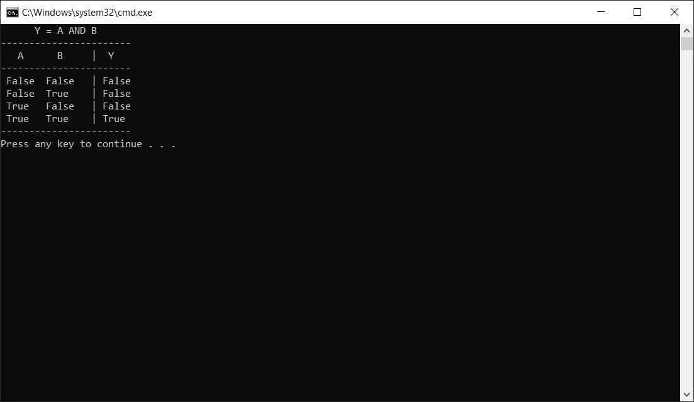

👷 ให้เขียนโปรแกรมเพื่อสร้างตารางความจริงของลอจิกดังต่อไปนี้

1. `AND`
2. `OR`
3. `NOT`
4. `NAND`
5. `NOR`
6. `Exclusive OR`

```csharp
using System;
public class intergerTest
{
    static void Main(string[] args)
    {
        bool A, B, Y;
            Console.WriteLine("      Y = A AND B");
            Console.WriteLine("-----------------------");
            Console.WriteLine("   A      B\t|  Y");
            Console.WriteLine("-----------------------");
            A = false; B = false; Y = A & B;
            Console.WriteLine(" {0}\t{1}\t| {2}", A, B, Y);
            A = false; B = true; Y = A & B;
            Console.WriteLine(" {0}\t{1}\t| {2}", A, B, Y);
            A = true; B = false; Y = A & B;
            Console.WriteLine(" {0}\t{1}\t| {2}", A, B, Y);
            A = true; B = true; Y = A & B;
            Console.WriteLine(" {0}\t{1}\t| {2}", A, B, Y);
            Console.WriteLine("-----------------------");

            Console.WriteLine("\n      Y = A OR B");
            Console.WriteLine("-----------------------");
            Console.WriteLine("   A      B\t|  Y");
            Console.WriteLine("-----------------------");
            A = false; B = false; Y = A | B;
            Console.WriteLine(" {0}\t{1}\t| {2}", A, B, Y);
            A = false; B = true; Y = A | B;
            Console.WriteLine(" {0}\t{1}\t| {2}", A, B, Y);
            A = true; B = false; Y = A | B;
            Console.WriteLine(" {0}\t{1}\t| {2}", A, B, Y);
            A = true; B = true; Y = A | B;
            Console.WriteLine(" {0}\t{1}\t| {2}", A, B, Y);
            Console.WriteLine("-----------------------");

            Console.WriteLine("\n      Y = A NOT B");
            Console.WriteLine("-----------------------");
            Console.WriteLine("   A \t|  Y");
            Console.WriteLine("-----------------------");
            A = false; Y = true;
            Console.WriteLine(" {0}\t| {1}", A, Y);
            A = true; Y = false;
            Console.WriteLine(" {0}\t| {1}", A, Y);

            Console.WriteLine("-----------------------");

            Console.WriteLine("      Y = A NAND B");
            Console.WriteLine("-----------------------");
            Console.WriteLine("   A      B\t|  Y");
            Console.WriteLine("-----------------------");
            A = false; B = false; Y = !(A & B);
            Console.WriteLine(" {0}\t{1}\t| {2}", A, B, Y);
            A = false; B = true; Y = !(A & B);
            Console.WriteLine(" {0}\t{1}\t| {2}", A, B, Y);
            A = true; B = false; Y = !(A & B);
            Console.WriteLine(" {0}\t{1}\t| {2}", A, B, Y);
            A = true; B = true; Y = !(A & B);
            Console.WriteLine(" {0}\t{1}\t| {2}", A, B, Y);
            Console.WriteLine("-----------------------");

            Console.WriteLine("\n      Y = A NOR B");
            Console.WriteLine("-----------------------");
            Console.WriteLine("   A      B\t|  Y");
            Console.WriteLine("-----------------------");
            A = false; B = false; Y = !(A | B);
            Console.WriteLine(" {0}\t{1}\t| {2}", A, B, Y);
            A = false; B = true; Y = !(A | B);
            Console.WriteLine(" {0}\t{1}\t| {2}", A, B, Y);
            A = true; B = false; Y = !(A | B);
            Console.WriteLine(" {0}\t{1}\t| {2}", A, B, Y);
            A = true; B = true; Y = !(A | B);
            Console.WriteLine(" {0}\t{1}\t| {2}", A, B, Y);
            Console.WriteLine("-----------------------");

            Console.WriteLine("      Y = A XOR B");
            Console.WriteLine("-----------------------");
            Console.WriteLine("   A      B\t|  Y");
            Console.WriteLine("-----------------------");
            A = false; B = false; Y = A ^ B;
            Console.WriteLine(" {0}\t{1}\t| {2}", A, B, Y);
            A = false; B = true; Y = A ^ B;
            Console.WriteLine(" {0}\t{1}\t| {2}", A, B, Y);
            A = true; B = false; Y = A ^ B;
            Console.WriteLine(" {0}\t{1}\t| {2}", A, B, Y);
            A = true; B = true; Y = A ^ B;
            Console.WriteLine(" {0}\t{1}\t| {2}", A, B, Y);
            Console.WriteLine("-----------------------");
    }
}
```

## ชนิดข้อมูลตัวเลขจำนวนเต็ม (Integer Types)

ข้อมูลชนิดตัวเลขจำนวนเต็ม สามารถนำไปใช้งานได้หลากหลาย เช่น การนับหรือแสดงจำนวน การกำหนดลำดับที่ การจัดลำดับ เป็นต้น ค่าที่ใส่ลงในตัวแปร เป็นได้ทั้งค่าบวก ค่าศูนย์ และค่าลบ (มีตัวแปรบางชนิดที่เก็บเฉพาะค่าบวกเพียงอย่างเดียว) การกำหนดค่าใดๆ ให้กับตัวแปร ทำได้โดยการใช้เครื่องหมาย =
การใช้เครื่องหมายคณิตศาสตร์กับตัวแปรจำนวนเต็ม สามารถใช้ได้ทุกเครื่องหมาย ได้แก่ +, -, *, / และ %

## 17. การใช้เครื่องหมายทางคณิตศาสตร์กับตัวแปรชนิดจำนวนเต็ม

👉 ให้เขียนโปรแกรมต่อไปนี้

```csharp
using System;
public class intergerTest
{
    static void Main(string[] args)
    {
        int a, b, c, d, e, f;
        a = 1;
        b = a + 6;
        c = b - 3;
        d = c * 2;
        e = d / 2;
        f = e % 2;
    }
}
```

➢ รันโปรแกรมและบันทึกผล

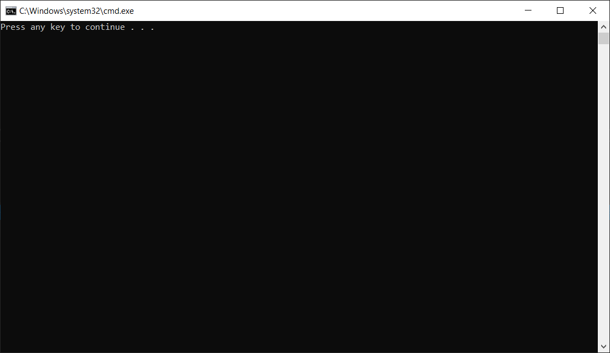

## 18. หาค่าจากสมการทางคณิตศาสตร์

กำหนด ```a = 10, b = 20, x = 5, y = 2``
👉 ให้เขียนโปรแกรมเพื่อหาผลลัพธ์ของสมการต่อไปนี้

1. `a+b`
2. `x-b`
3. `x*b`
4. `y/a`
5. `b%y`
6. `y+10%x`
7. `a/3*5`
8. `9/2*a`
9. `y%8`
10. `100*x+y%2-a`


## ชนิดข้อมูลเลขทศนิยม (Floating Point and Decimal Types)

ตัวเลขจำนวนทศนิยม มักจะใช้ในการคำนวณทางวิทยาศาสตร์ เนื่องจากค่าในวิทยาศาสตร์ต้องการความละเอียดสูง หรือมีค่าสูงมากกว่าที่เลขจำนวนเต็มจะเก็บได้

### ตัวอย่างการแก้ปัญหาทางวิทยาศาสตร์

ระยะทางจากดาวอาทิตย์ถึงโลกคือ 93,000,000 ไมล์ เรียกว่า 1 A.U. (Astronomical Unit)
ความเร็วในการเดินทางของแสงคือ 186,000 ไมล์ต่อวินาที
ระยะทาง 1 ไมล์ คิดเป็น 1.609344 กิโลเมตร
ให้เขียนโปรแกรมหาระยะทางในการเดินทางของแสง ในหน่วยกิโลเมตรต่อวินาทีและเวลาในการเดินทางของแสงจากดวงอาทิตย์มายังโลก

## 19.  โปรแกรมคำนวณระยะทางและเวลาของแสงจากดวงอาทิตย์ถึงโลก

👉 ให้เขียนโปรแกรมต่อไปนี้

```csharp
using System;
namespace variableProperties
{
    class Program
    {
        static void Main(string[] args)
        {
            const double lightSpeed = 186000d;   // miles per second
            Console.WriteLine("Light speed = {0} Mile Per second", lightSpeed);
            const double mileTokm = 1.609344;
            Console.WriteLine("Light speed = {0} km Per second", lightSpeed*mileTokm);
            const double SunToEarthDistance =  93000000d ;  // miles
            Console.WriteLine("SunToEarthDistance = {0} km", SunToEarthDistance * mileTokm);
            double SunToEarthTimeOfLight = SunToEarthDistance / lightSpeed;  // miles
            Console.WriteLine("SunToEarthTimeOfLight = {0} seconds", SunToEarthTimeOfLight);
            Console.WriteLine("SunToEarthTimeOfLight = {0} minutes", SunToEarthTimeOfLight/60d);
        }
    }
}
```

➢ รันโปรแกรมและบันทึกผล

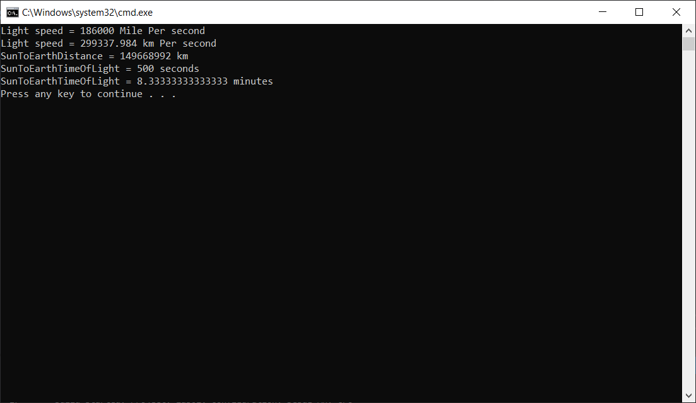

👷 คำสั่ง ให้เขียนโปรแกรมคำนวณค่าเพื่อเติมลงในช่องว่างในตาราง
ตารางที่ 1 ระยะทางจากดวงอาทิตย์ถึงดาวเคราะห์ต่างๆ

```csharp
using System;
namespace variableProperties
{
    class Program
    {
        static void Main(string[] args)
        {
            const long merc = 57910000;
            const long ven = 108200000;
            const long eath = 149600000;
            const long mars = 227330000;
            const long jup = 778330000;
            const long ura = 2873550000;
            const long nep = 4501000000;
            const long pluto = 5945900000;

            const double AU = 6.684587123e-9;
            const double lm = 8.317;

            Console.Write("Mercury");
            Console.WriteLine("Distance from the sun : {0, 0:n} KM", merc);
            Console.WriteLine("Distance of A.U>      : {0, 0:n10} AU", AU * merc);
            Console.WriteLine("light-minute          : {0, 0:n10} light minute", ((AU * merc) * lm));
            Console.WriteLine("Venus");
            Console.WriteLine("Distance from the sun : {0, 0:n} KM", ven);
            Console.WriteLine("Distance of A.U>      : {0, 0:n10} AU", AU * ven);
            Console.WriteLine("light-minute          : {0, 0:n10} light minute", ((AU * ven) * lm));
            Console.WriteLine("Earth");
            Console.WriteLine("Distance from the sun : {0, 0:n} KM", eath);
            Console.WriteLine("Distance of A.U>      : {0, 0:n10} AU", AU * eath);
            Console.WriteLine("light-minute          : {0, 0:n10} light minute", ((AU * eath) * lm));
            Console.WriteLine("Mars");
            Console.WriteLine("Distance from the sun : {0, 0:n} KM", mars);
            Console.WriteLine("Distance of A.U>      : {0, 0:n10} AU", AU * mars);
            Console.WriteLine("light-minute          : {0, 0:n10} light minute", ((AU * mars) * lm));
            Console.WriteLine("Jupiter");
            Console.WriteLine("Distance from the sun : {0, 0:n} KM", jup);
            Console.WriteLine("Distance of A.U>      : {0, 0:n10} AU", AU * jup);
            Console.WriteLine("light-minute          : {0, 0:n10} light minute", ((AU * jup) * lm));
            Console.WriteLine("Uranus");
            Console.WriteLine("Distance from the sun : {0, 0:n} KM", ura);
            Console.WriteLine("Distance of A.U>      : {0, 0:n10} AU", AU * ura);
            Console.WriteLine("light-minute          : {0, 0:n10} light minute", ((AU * ura) * lm));
            Console.WriteLine("Neptune");
            Console.WriteLine("Distance from the sun : {0, 0:n} KM", nep);
            Console.WriteLine("Distance of A.U>      : {0, 0:n10} AU", AU * nep);
            Console.WriteLine("light-minute          : {0, 0:n10} light minute", ((AU * nep) * lm));
            Console.WriteLine("Pluto");
            Console.WriteLine("Distance from the sun : {0, 0:n} KM", pluto);
            Console.WriteLine("Distance of A.U>      : {0, 0:n10} AU", AU * pluto);
            Console.WriteLine("light-minute          : {0, 0:n10} light minute", ((AU * pluto) * lm));
        }
    }
}
```

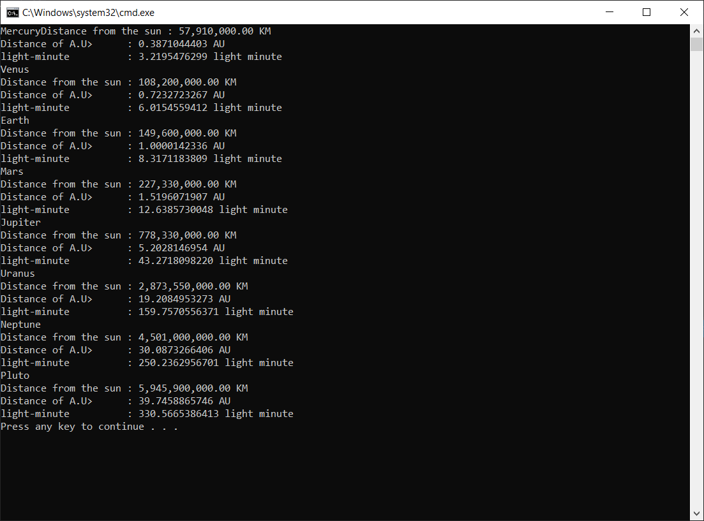
| ดาวเคราะห์ | ระยะทางจากดวงอาทิตย์ | ระยะทางในหน่วย A.U. | เวลาของแสง (นาที)
|---|---|---|---|
| Mercury |    57,910,000 km |  0.3871044403  |   3.2195476299
| Venus   |   108,200,000 km |  0.7232723267  |   6.0154559412
| Earth   |   149,600,000 km |  1.0000142336  |   8.3171183809
| Mars    |   227,940,000 km |  1.5196071907  |  12.6385730048
| Jupiter |   778,330,000 km |  5.2028146954  |  43.2718098220
| Uranus  | 2,873,550,000 km | 19.2084953273  | 159.7570556371
| Neptune | 4,501,000,000 km | 30.0873266406  | 250.2362956701
| Pluto   | 5,945,900,000 km | 39.0873266406  | 330.5665386413

### คลาส Math ในภาษา C# มีคลาสที่เป็นตัวช่วยคำนวณทางคณิตศาสตร์ ที่ช่วยให้เราสามารถคำนวณฟังก์ชันพื้นฐานได้ อย่างรวดเร็ว ไม่ต้องพัฒนาโปรแกรมเพิ่มเติมด้วยเอง นั่นคือคลาส Math ฟังก์ชันทางคณิตศาสตร์ที่ใช้บ่อยๆ สามารถดูรายละเอียดทั้งหมดได้จาก `system.math`

## 20.  โปรแกรมพล็อตรูป sine wave บนหน้าจอ

👉 ให้เขียนโปรแกรมต่อไปนี้

```csharp
using System;
public class MathTest
{
    static void Main(string[] args)
    {
        for (float i = 0; i < Math.PI * 2.0F; i += 0.3F)
        {
            Console.WriteLine("The sine of {0,10:F} = {1,-10:F6}" + spaces(Math.Sin(i)) + "*", i, Math.Sin(i));
        }
    }
    private static string spaces(double val)
    {
        string SpaceString = new String(' ', ((int)(val * 10.0)) + 10);
        return SpaceString;
    }
}
```

➢ รันโปรแกรมและบันทึกผล

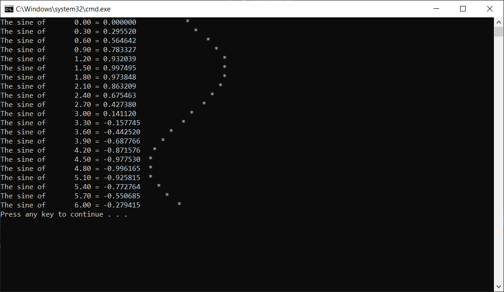

👷 ให้ดัดแปลงโปรแกรมเพื่อวาดรูปคลื่นดังต่อไปนี้

1. ``y = x2``

```csharp
using System;
public class MathTest
{
    static void Main(string[] args)
    {
        for (float i = -6; i < Math.PI * 2.0F; i += 0.3F)
        {
            Console.WriteLine("The Palabola of {0,10:F} = {1,-10:F6}" + spaces(Math.Pow(i,2)) + "*", i, Math.Pow(i,2));
        }
    }
    private static string spaces(double val)
    {
        string SpaceString = new String(' ', ((int)(val * 10.0)) + 10);
        return SpaceString;
    }
}
```

2. ``y = cos(x)``

```csharp
using System;
public class MathTest
{
   static void Main(string[] args)
    {
        for (float i = 0; i < Math.PI * 2.0F; i += 0.3F)
        {
            Console.WriteLine("The cosine of {0,10:F} = {1,-10:F6}" + spaces(Math.Cos(i)) + "*", i, Math.Cos(i));
        }
    }
    private static string spaces(double val)
    {
        string SpaceString = new String(' ', ((int)(val * 10.0)) + 10);
        return SpaceString;
    }
}
```

3. ``y = tan(x)``

```csharp
using System;
public class MathTest
{
    static void Main(string[] args)
    {
        for (float i = -3; i < (Math.PI); i += 0.3F){
                {
                    Console.WriteLine("The sine of {0,10:F} = {1,-10:F6}" + spaces(Math.Tan(i)) + "*", i, Math.Tan(i));
                }
        }
    }

    private static string spaces(double val)
    {
        string SpaceString;
        try
        {
            SpaceString = new String(' ', ((int)(val * 10.0)) + 10);
        }
        catch (ArgumentException)
        {
            return " ";
        }
        return SpaceString;
    }
}
```
