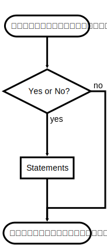

# พื้นฐานภาษา C#

# 1. ส่วนประกอบของภาษา
## 1.1 Identifiers
Identifiers เป็นอักขระตัวเดียวหรือหลายตัว (strings) ที่ใช้แทนชื่อของตัวแปร เมธอด พารามิเตอร์ หรืออื่นๆ ที่สามารถเก็บค่าและ/หรือเรียกใช้ค่าจากมันในภายหลังได้ โดยทั่วไปในการสร้าง identifier เรามักจะตั้งชื่อให้มีความหมายในตัว (self-documenting identifiers) โดยการนำคำต่างๆ มาสร้างเป็นชื่อของ identifier ที่มีความหมายเป็นเอกลักษณ์ เช่น FirstName, LastName เป็นต้น โดยการตั้งชื่อต้องเป็นไปตามกฏการตั้งชื่อในภาษา C# โดย identifier ประกอบด้วยอักษรต่างๆ ดังนี้
•	ตัวอักษรในภาษาอังกฤษ (a ถึง z และ A ถึง Z) รวมทั้งเครื่องหมาย underscore (_) โดยสามารถอยู่ในตำแหน่งใดๆ ก็ได้
•	ตัวเลข 0-9 แต่ห้ามใช้เป็นตัวอักษรขึ้นต้น 
•	เครื่องหมาย @ สามารถใช้เป็นตัวอักษรตัวแรก แต่ห้ามใช้ในตำแหน่งอื่นๆ


__รูปที่ 1__ การตั้งชื่อ identifier

Identifier จะมีลักษณะที่เรียกว่า case sensitive ดังนั้นต้องระวังในการใช้ตัวอักษรพิมพ์เล็กและพิมพ์ใหญ่ เช่น myVar และ MyVar จะเป็น identifier คนละตัวกัน

## 1.2 คำสงวน (Keywords) 
คำสงวน ไม่สามารถนำมาใช้เป็นชื่อตัวแปรหรือ identifier ใดๆ ได้ ยกเว้นว่าจะใส่เครื่องหมาย @ ไว้ข้างหน้า โดยคำสงวนทุกคำในภาษา C# จะเป็นตัวพิมพ์เล็กทั้งคำ ยกเว้นชนิดข้อมูลใน .NET จะใช้หลักการตั้งชื่อแบบ Pascal casing ตารางด้านล่างนี้คือคำสงวนในภาษา C#


|abstract|  
|const 
|extern
|int
|out
|short
|typeof
|as	
|continue	
|false
|interface
|override
|sizeof
|uint | 
|base 
|decimal	
|finally
|internal
|params
|stackalloc
|ulong
|bool|	default|	fixed|	is|	private|	static|	unchecked|
|break|	delegate|	float|	lock|	protected|	string|	unsafe|
|byte|	do	|for|	long|	public|	struct|	ushort|
|case|	double|	foreach|	namespace|	readonly|	switch|	using|
|catch|	else|	goto|	new|	ref|	this|	virtual|
|char|	enum|	if|	null|	return|	throw|	void|
|checked|	event|	implicit|	object|	sbyte|	true|	volatile|
|class|	explicit|	in|	operator|	sealed|	try|	while|


## 1.3 Contextual keywords
Contextual keywords จัดเป็น identifiers แต่มีการใช้งานเหมือนคำสงวน เป็นคำที่ใช้ในตำแหน่งเดียวกับคำสงวนของภาษา มันไม่ใช่คำสงวนและไม่สามารถใช้เป็นชื่อหรือ identifier ได้ ดังตารางต่อไปนี้
add	ascending	async	await	by	descending	dynamic 
equals	from 	get 	global 	group 	in 	into
join 	let 	on 	orderby 	partial 	remove 	select
set 	value 	var	where	yield		

## 1.4 อักษรว่าง Whitespace 
อักษรว่างในโปรแกรมคืออักษรที่มองไม่เห็นเป็นรูปแบบของตัวอักษร (เป็นช่องว่าง) อักษรว่างในโปรแกรมจะถูกมองข้ามโดยคอมไพลเลอร์ โดยประกอบด้วยอักษรต่อไปนี้   
•	`Space`   
•	Tab   
•	New line   
•	Carriage return  
ในภาษา C# นั้น เรามีอิสระที่จะจัดวางอักษรต่างๆ ไว้ที่ตำแหน่งใดก็ได้ โดยคอมไพเลอร์จะพิจารณาการจบบรรทัดด้วยเครื่องหมาย `;` และขอบเขตของบล็อกด้วยเครื่องหมายวงเล็บปีกกา `{` และ `}`

```csharp
// แบบกระชับ
Main(){Console.WriteLine("Hi, there!");}
```
```csharp
// แบบที่อ่านง่ายกว่า
Main() 
{ 
    Console.WriteLine("Hi, there!"); 
}
```
## 1.5 Statements
Statements ในภาษา C# จะคล้ายกับในภาษา C และ C++ มีหน้าที่บอกให้โปรแกรมทำงานตามลำดับที่ได้เขียนไว้ตามลำดั โดย statements ต้องจบด้วยเครื่องหมาย semicolon (`;`) 

```csharp
int var1 = 5; 
System.Console.WriteLine("The value of var1 is {0}", var1); 
```

## 1.6 Block
บล็อกอาจจะว่างเปล่าหรือประกอบด้วย statements ตั้งแต่หนึ่ง statement ขึ้นไป โดยขอบเขตของบล็อกเป็นเครื่องหมายวงเล็บปีกกา 
```csharp
{ 
    int var1 = 5; 
    System.Console.WriteLine("The value of var1 is {0}", var1); 
}
```

# 2. ตัวแปรและชนิดของข้อมูล Variables and Types
__ตัวแปรในภาษาคอมพิวเตอร์__  
หมายถึงพื้นที่เก็บข้อมูลที่ถูกสร้างขึ้นในหน่วยความจำ เราสามารถใส่ข้อมูลลงไปในตัวแปรและสามารถเรียกใช้ข้อมูลผ่านตัวแปร คุณสมบัติอย่างหนึ่งของตัวแปรคือ ขนาด ซึ่งกำหนดความสามารถในการเก็บข้อมูล โดยทั่วไปตัวแปรจะเก็บข้อมูลที่แตกต่างกันได้เป็นจำนวน 2 ยกกำลังจำนวนบิต ซึ่งเราสามารถสื่อไปยังคอมไพเลอร์ให้จองพื้นที่ผ่านชนิดข้อมูล (data type) ของตัวแปรนั้นๆ  
ภาษา C# เป็นภาษาโปรแกรมแบบ strong type หมายความว่า เราต้องระบุชนิดข้อมูลของตัวแปรก่อนใช้งาน (เช่น `integers`, `floats`, `strings`, `windows`, `buttons`, เป็นต้น) โดยชนิดข้อมูลในภาษา C# แบ่งออกได้เป็น 2 กลุ่มคือ ชนิดข้อมูลที่มาพร้อมภาษา (built-in types) เช่น `int`, `bool`, `long` เป็นต้น และชนิดข้อมูลที่เราสร้างเอง (`user-defined types`) ในภาษา C# ได้แบ่งประเภทการใช้งานตัวแปรออกเป็น 3 รูปแบบได้แก่
1.	value type เก็บข้อมูลที่เรียกใช้งานได้ทันที
2.	reference type เก็บเฉพาะตำแหน่งที่อยู่ในหน่วยความจำของตัวแปร (หรือวัตถุ)
3.	pointer type ซึ่งมีลักษณะเหมือน pointer ในภาษา C หรือ C++ แต่ไม่ค่อยนิยมใช้ เนื่องจากถูกจัดอยู่ในประเภท code ที่ไม่ปลอดภัยสำหรับ .NET (unsafe codes)

__ตัวแปรหรือวัตถุในหน่วยความจำ__  
ตัวแปรหรือวัตถุที่สร้างขึ้นในหน่วยความจำ สามารถเก็บได้ใน 2 แห่งคือ บน stack ของ application หรือบน heap (ซึ่งเป็นหน่วยความจำส่วนรวม) การสร้างตัวแปรบน stack นั้น สามารถสร้างและเรียกใช้งานได้ทันที เนื่องจากระบบได้มอบหน่วยความจำส่วนนั้นให้กับ application ของเราแล้ว เราจะใช้อย่างไรก็ได้ แต่ในส่วนของหน่วยความจำ heap ซึ่งมีการใช้งานร่วมกันทั้งระบบ จะต้องได้รับอนุญาตเสียก่อน จึงจะนำมาใช้ได้ วิธีการใช้งานหน่วยความจำบน heap มีขั้นตอนย่อยๆ อยู่ 4 ขั้นตอนคือ  

1. สร้างตัวแปร reference ขึ้นบน stack (ของ application)  
2. จองหน่วยความจำบน heap ด้วยคำสั่ง new แล้วนำตำแหน่งมาเก็บไว้ในตัวแปร reference ในข้อ 1  
3. ใช้งานหน่วยความจำข้อ 3 (ถ้าจองไม่ได้ ระบบจะให้ค่าตำแหน่ง 0 กลับมา)  
4. เมื่อใช้งานเสร็จ ให้คืนหน่วยความจำกลับสู่ระบบ

## 2.1 ข้อมูลชนิดตรรกะ The Boolean Type
ในการสร้างตัวแปร boolean นั้น จะใช้คำว่า `bool` ซึ่งจะเก็บค่าได้เพียง 2 ค่าเท่านั้นคือ `true` และ `false` ในภาษาอื่น เช่น ภาษา C, C++ นั้น สามารถใช้เลข 0 แทน `false` และเลข 1 แทน `true` ได้ แต่ในภาษา C# จะไม่สามารถทำได้

| ชนิด	| ขนาด (บิต)	| ขอบเขตการเก็บข้อมูล|
|:-----|:------------:|:---------------|
|bool	|  8	| true และ false|

## 2.2 ชนิดข้อมูลตัวเลข (Integer Types)
ในภาษา C# ชนิดข้อมูลตัวเลข เป็นหมวดของชนิดข้อมูลตัวเลขจำนวนเต็ม ทั้ง `signed`, `unsigned`, รวมถึงข้อมูลตัวอักษร (`char`) ซึ่ง Unicode character

| ชนิด	| ขนาด (บิต)	|ขอบเขตการเก็บข้อมูล|
|:-----|:------------:|:---------------|
|Sbyte	|8	|-128 ถึง 127
|Byte	|8	|0 ถึง 255
|Short	|16	|-32768 ถึง 32767
|ushort	|16	|0 ถึง 65535
|Int	|32	|-2147483648 ถึง 2147483647
|Uint	|32	|0 ถึง 4294967295
|Long	|64	|-9223372036854775808 ถึง 9223372036854775807
|Ulong	|64	|0 ถึง 18446744073709551615
|Char	|16	|0 ถึง 65535

หมวดของชนิดข้อมูลตัวเลขนี้ สามารถนำมาคำนวณทางคณิตศาสตร์ได้ทุกชนิด (ยกเว้นชนิด `char`) ในการเลือกใช้งานตัวแปรชนิดต่างๆ ต้องพิจารณาจากขอบเขตของข้อมูลที่เก็บได้เป็นสำคัญ

## 2.3 ชนิดข้อมูลเลขทศนิยม (Floating Point and Decimal Types)
ชนิดข้อมูลทศนิยมทั้ง float และ double จะถูกใช้แทนจำนวนจริง ซึ่งนิยมใช้ในการคำนวณทางวิทยาศาสตร์หรือในกรณีที่ไม่สามารถเขียนในรูปเศษส่วนที่หารได้ลงตัว ส่วน decimal นิยมใช้ในทางการเงิน (financial) เพราะว่าสามารถหลีกเลี่ยงปัญหาในการปัดเศษ (rounding errors) ได้

|ชนิด	  | ขนาด (บิต)	|ความละเอียดทศนิยม (ตำแหน่ง)	|ขอบเขต
|:--------|:---:|:-----|:-----|
|float	  |32  |	7 	|1.5 x 10-45 ถึง 3.4 x 1038
|double	  |64	 |15-16	|5.0 x 10-324 ถึง 1.7 x 10308
|decimal  |128	|28-29	|1.0 x 10-28 ถึง 7.9 x 1028

## 2.4 	ข้อความ (String Type)
ข้อความ (`String`) เป็นอักขระ (`Char`) ที่เขียนเรียงต่อกันเป็นข้อความ ในบางกรณีเราต้องการใช้งานตัวอักษรที่ไม่สามารถพิมพ์ออกหน้าจอ (หรือไม่ได้อยู่บนแป้นพิมพ์) ในภาษา C# ก็อนุญาตให้ใช้อักขระเหล่านั้นโดยเขียนนำหน้าด้วยเครื่องหมาย '\' เรียกว่า `Escape Sequence`

| Escape Sequence	|ความหมาย|
|:------|:------|
|\'	|Single Quote
|\"	|Double Quote
|\\	|Backslash
|\0	|Null, คนละอย่างกับ null value ในภาษา C#  
|\a	|Bell
|\b	|Backspace
|\f	|form Feed
|\n	|Newline
|\r	|Carriage Return
|\t	|Horizontal Tab
|\v	|Vertical Tab

## 2.5.	ตัวแปรและค่าคงที่ (Variable and constant)
ตัวแปรใช้สำหรับเก็บข้อมูลและต้องการที่อยู่ในหน่วยความจำ โดยขนาดหน่วยความจำขึ้นกับชนิดของตัวแปรนั้นๆ ในการใช้งานตัวแปร (Variable) เราสามารถกำหนดค่าได้ทั้งในขณะสร้างและใช้งาน สำหรับค่าคงที่ (constant) เราสามารถกำหนดค่าขณะสร้างแต่ไม่สามารถเปลี่ยนค่าขณะใช้งาน การเลือกใช้งานระหว่างตัวแปรหรือค่าคงที่นั้น ต้องดูว่าต้องการเปลี่ยนค่าในตัวแปรนั้นในขณะใช้งานหรือไม่ เช่น หากต้องการเก็บค่าคงที่ทางวิทยาศาสตร์ ก็ควรเก็บใน constant แทนที่จะเป็นตัวแปร

## 2.6.	Enumeration
Enumerations เป็นวิธีการหนึ่ง ในการใช้ค่าคงที่ได้อย่างมีประสิทธิภาพ โดยการตั้งชื่อเรียกให้กับกลุ่มของค่าคงที่อย่างเป็นระบบ (เรียกว่า enumerator list) 
ตัวอย่าง
```csharp
class Program
{
    enum Days { Sunday, Monday, Tuesday, Wednesday, Thursday, Friday, Saturday };
    static void Main(string[] args)
    {
        int x = (int)Days.Sunday;
        int y = (int)Days.Friday;
        Console.WriteLine("Sunday = {0}", x);
        Console.WriteLine("Friday = {0}", y);
    }
}
```
Output
 


## 2.7.	สมการ (Expression)
สมการ หรือ Expression ในภาษา C# คือประโยคที่ใช้ประเมินค่า evaluate ของสมการต่างๆ โดยการกระทำผ่านเครื่องหมาย และจบด้วยเครื่องหมาย semicolon เช่น

```csharp
myVariable = 30;
```

ด้านซ้ายของเครื่องหมาย = เรียกว่า `lvalue` และด้านขวาของเครื่องหมาย = เรียกว่า `rvalue` โดย `lvalue` จะต้องมีสถานะเป็นตัวแปรที่สามารถเก็บข้อมูลได้ ในภาษา C# เราสามารถกำหนดค่าตัวแปรได้เป็นจำนวนมากผ่าน expression เช่น

```csharp
a = b = c = d = e = 30;
```
## 2.8.	คำสั่ง (Statement)
ในภาษา C# เราเรียกคำสั่งที่ทำงานได้โดยสมบูรณ์ว่า statement ซึ่งอาจเป็นประโยคกำหนดค่าหรือประโยคที่เรียกใช้ฟังก์ชันต่างๆ ก็ได้ โดยคำสั่งจะถูกเรียกทำงานตามลำดับจากบนลงล่าง ตามที่เราเขียนลงไปใน source code  



``` flow
st=>start: Start
e=>end
op=>operation: My Operation
cond=>condition: Yes or No?

st->op->cond
cond(yes)->e
cond(no)->op
```